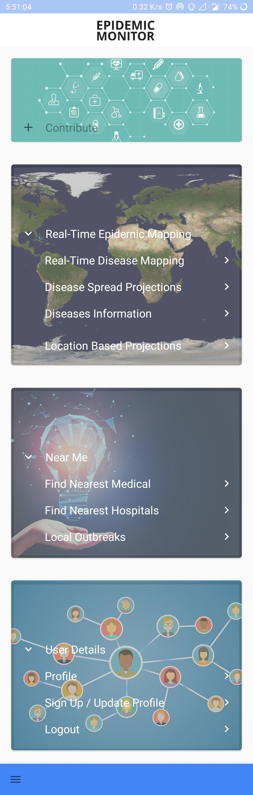
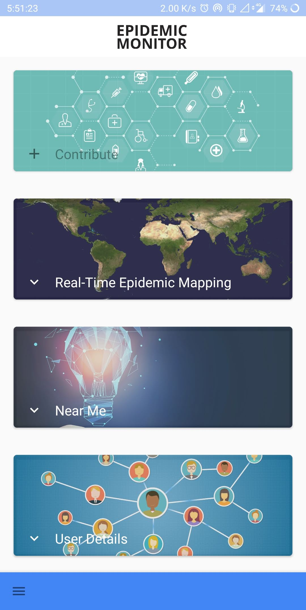
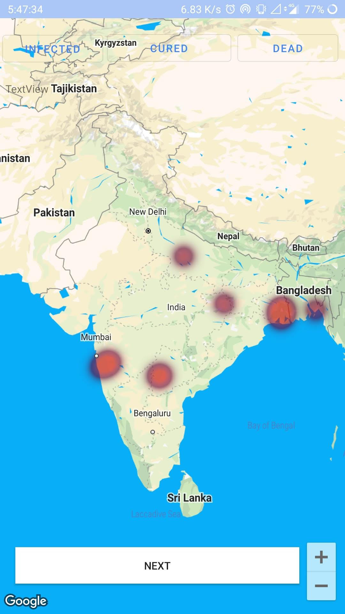
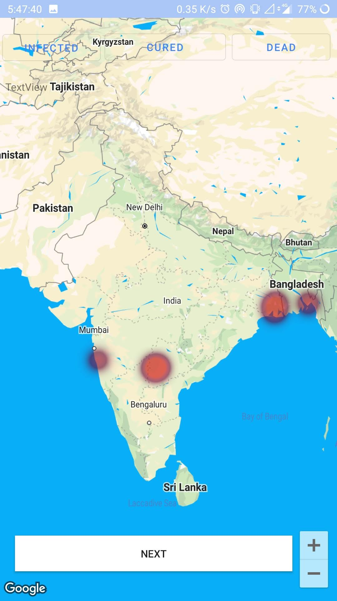
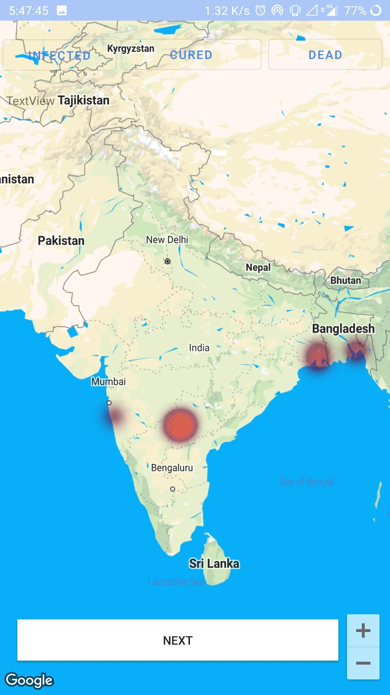
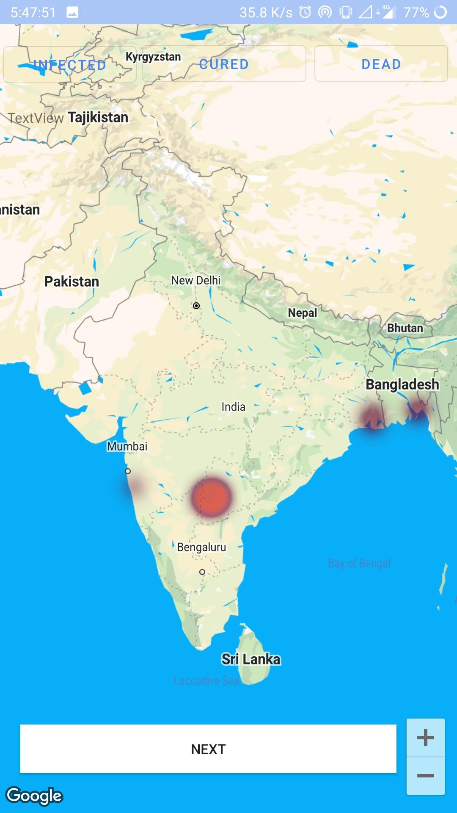
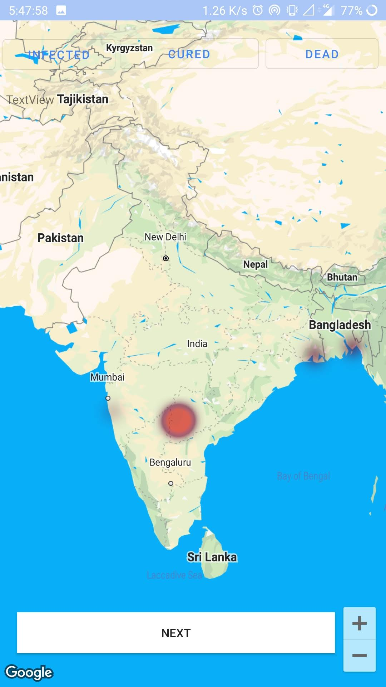
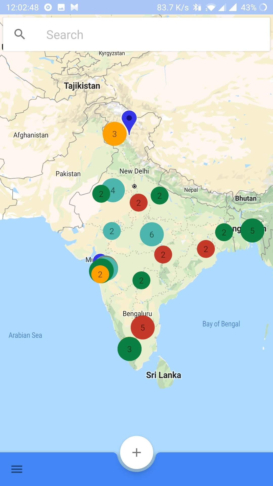
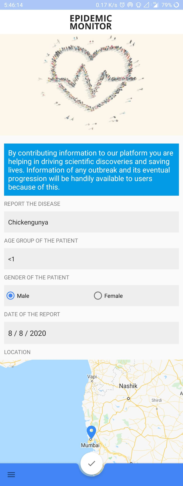
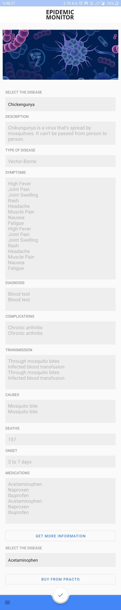

# Epidemic Monitor — Resolve to Prevent Epidemics
## Smart India Hackathon 2019 for Thermo Fisher Scientific 

This project was part of **Smart India Hackathon 2019** which is the **World's Biggest Open Innovation Model** with over 57897 Idea Proposals, 34000+ Teams from all over India and over 200,000+ Students participating in the hackathon.

Our six-membered team was selected as one of the top 4 finalists for the problem statement KR1 given by Thermo Fisher Scientific which had north of 700 proposal submissions for the statement.

## Screenshots

### Homepage

### Prediction of Cases over next 5 weeks

### Visualization of Cases

### Contribute / Crowdsourcing Data

### Diseases Information

## Setup
